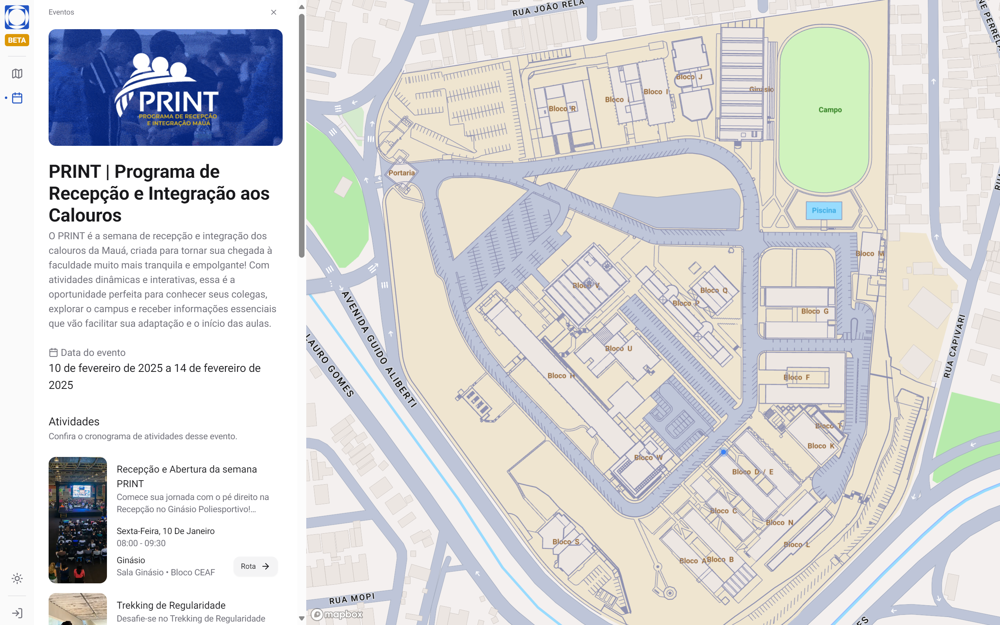

# Mauá Map - University Campus Map Application

## Overview

Mauá Map is a virtual campus map application for the Instituto Mauá de Tecnologia. This interactive web application provides users with an intuitive interface to navigate the campus, find rooms, view upcoming events, and more.

## Features

- Interactive campus map using Mapbox GL and deck.gl
- Event listing and detailed event pages
- Room information and search functionality
- User geolocation tracking
- Dark mode support
- Responsive design for mobile and desktop
- Integration with Payload CMS for content management
- Accessibility features

## Key Technologies

- **Graph Database**: We utilize PostgreSQL with the PostGIS extension to store and query spatial data efficiently. This allows for complex geospatial queries and pathfinding operations.

- **Campus Outline Generation**: The campus outline was initially derived from a CAD blueprint. It was then processed and optimized using a custom Python utility, which you can find here: [blueprint-kml-parser](https://github.com/ruymon/blueprint-kml-parser).

## Tech Stack

- Next.js 15 with App Router
- React 19
- TypeScript
- Tailwind CSS
- Mapbox GL
- deck.gl
- Payload CMS
- PostgreSQL with PostGIS extension
- Zustand for state management
- React Query
- Sonner for toast notifications

## Prerequisites

- Node.js (v18.20.2 or v20.9.0+)
- npm or yarn
- Mapbox API key
- PostgreSQL database with PostGIS extension
- Payload CMS setup

## Getting started

1. Run `npm i` followed by `npm run dev` to install the dependencies and start the development server.

2. Add your API keys to the `.env` file.

- `NEXT_PUBLIC_MAPBOX_ACCESS_TOKEN`: The map is generated using [Mapbox GL JS](https://docs.mapbox.com/mapbox-gl-js/api/).

3. Navigate to [http://localhost:3000/](http://localhost:3000/) to see the app in action.

> We recommend leaving the [`serverComponentsHmrCache` config option](https://nextjs.org/docs/app/api-reference/next-config-js/serverComponentsHmrCache) enabled while developing to reduce API calls between saves. However, we disabled it during the keynote to allow us to refetch data across Fast Refresh.

## Screenshots

_Caption: Overview of the interactive campus map_

_Caption: Event listing page showing upcoming campus events_

_Caption: Event details page showing all activities of a given campus event_

_Caption: Room search functionality with real-time results_

_Caption: Responsive design optimized for mobile devices_

## Graph Database and Spatial Data

Our application leverages the power of PostgreSQL with the PostGIS extension to handle complex spatial data and relationships:

- **Nodes and Edges**: Campus locations (buildings, rooms, points of interest) are represented as nodes, while pathways are represented as edges in our graph structure.
- **Spatial Indexing**: PostGIS allows for efficient spatial indexing, enabling fast queries for nearest neighbors, distances, and pathfinding.
- **Custom Routing**: We implement custom routing algorithms that take into account various factors like accessibility, indoor/outdoor paths, and real-time conditions.

The integration of this spatial graph database with our frontend map components allows for a seamless and responsive user experience when navigating the campus.

## Acknowledgements

- Mapbox for providing the mapping technology
- Payload CMS for content management
- Vercel for hosting and deployment
- PostGIS community for the powerful spatial database extension
- The creators of deck.gl for the WebGL-powered data visualization
